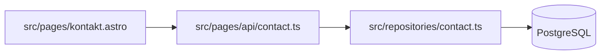

# Living Docs — lebende Projektdokumentation

Die Doku beschreibt, **wie das Projekt jetzt funktioniert** und **unter welchen Regeln
es aktuell weiterentwickelt wird**. Kein Changelog, kein Entwicklungstagebuch, kein
Archiv abgelöster Architekturentscheidungen. Historie liefert Git.

Quelle der Wahrheit bleibt das Repository. Dokumentiert wird, was im Code belegbar ist.

## Gotchas (zuerst lesen)

- **Ist-Zustand, keine Deltas.** Schlecht: „Version 1.4 hat Auth von eigenem JWT auf
  Better Auth umgestellt." Gut: „Authentifizierung läuft über Better Auth, Konfiguration
  in `src/auth/`." Bei einer Änderung wird der betroffene Abschnitt **umgeschrieben**,
  nicht ergänzt.
- **Nicht jede Änderung ist dokumentationsrelevant.** Ein CSS-Fix normalerweise nicht,
  der Wechsel von REST auf tRPC sehr wohl. Erst prüfen, ob eine der fünf Dateien
  tatsächlich unwahr geworden ist — sonst entsteht Doku-Müll.
- **Architektur nicht aus Dateinamen und `package.json` ableiten.** Repräsentative
  Quelldateien lesen, bevor Grenzen und Datenflüsse beschrieben werden.
- **Konventionen nicht erfinden.** Nur dokumentieren, was im Repo erkennbar ist oder
  vom Projektinhaber explizit festgelegt wurde — nicht, was allgemein als Best Practice gilt.
- **Annahme ≠ Anforderung.** Ungeklärtes als offene Frage markieren und nachfragen,
  statt es als Constraint festzuschreiben.
- **Veraltetes löschen**, nicht „für die Historie" stehen lassen.
- **Keine leeren Dateien.** Nur anlegen, was Inhalt hat. Vorhandene Doku (README,
  bestehende `docs/`) wiederverwenden statt duplizieren.

## Struktur

```
docs/
├── project-state.md   # kompakter Einstieg: Was ist das, wie läuft es, wo liegt was
├── architecture.md    # tatsächlich vorhandene Architektur
├── conventions.md     # Regeln für künftige Änderungen
├── constraints.md     # harte Rahmenbedingungen
└── decisions.md       # aktuell gültige Entscheidungen (keine Historie)
```

### project-state.md
Technischer Überblick, soweit zutreffend: Zweck der Anwendung, Stack, Runtime,
Deployment-Ziel, Hauptbereiche, wichtige Einstiegspunkte, Persistenz, Auth,
externe Dienste, Teststrategie, Links auf die übrigen Dateien.
Ziel: jemand ohne Repo-Kenntnis versteht die Grundstruktur schnell. Keine
Architektur-Detailtiefe — die steht nebenan.

### architecture.md
Module, Schichten, Komponentengrenzen, Datenfluss, Server/Client-Grenze, APIs,
Persistenz, Authentifizierung/Autorisierung, Hintergrundverarbeitung, externe
Integrationen, Deployment-Architektur, wichtige Abhängigkeiten.

Konkrete Pfade und Komponentennamen statt abstrakter Beschreibungen:

```
src/
├── components/
├── pages/
├── services/
├── repositories/
└── middleware/
```

Nur Architektur, die existiert — nichts Geplantes.

#### Diagramme (Mermaid)

Mermaid-Diagramme sind in allen Doku-Dateien erlaubt, am sinnvollsten in
`architecture.md`. Ein Diagramm gehört dorthin, wo es einen **Mechanismus** zeigt,
den Prosa nur umständlich umschreibt: Datenfluss, Request-Pfad, Server/Client-Grenze,
Deployment-Topologie, Zustandsautomat.

````markdown

````

- **Knoten mit echten Pfaden und Komponentennamen beschriften**, nicht mit
  generischen Kästen („Frontend", „Backend"). Dieselbe Belegbarkeitsregel wie für Prosa.
- **Diagramm ist Ist-Zustand.** Es veraltet schneller als Text und wird bei Abgleich
  und Release-Sync genauso geprüft wie jeder Absatz.
- **Kernaussage steht auch im Text.** Das Diagramm verdichtet, es ersetzt die Erklärung
  nicht — nicht jeder Renderer (und nicht jeder Screenreader) zeigt Mermaid.
- **Klein halten.** Über ~15 Knoten wird ein Diagramm unlesbar; dann lieber zwei
  Diagramme auf getrennten Ebenen.
- **Dekoratives weglassen.** Ein Diagramm, das nur die Verzeichnisliste daneben
  wiederholt, ist Sediment.

### conventions.md
Namensgebung, Verzeichnisstruktur, Komponentenorganisation, API-Konventionen,
Fehlerbehandlung, Logging, Datenbankzugriff, Abhängigkeitsregeln, Test- und
Accessibility-Erwartungen, Formatierung/Linting, bevorzugte Implementierungsmuster.

### constraints.md
Unterstützte Browser und Runtime-Versionen, Hosting- und DB-Grenzen,
API-Kompatibilität, Accessibility-, Security-, Datenschutz- und
Performance-Anforderungen, Rückwärtskompatibilität, Infrastruktur-Restriktionen.
Geprüfte Constraints und Annahmen klar auseinanderhalten.

### decisions.md
Pro Entscheidung: Was ist entschieden? Warum gilt das aktuell? Welche Konsequenz
hat das für die Implementierung?

> **Datenbankzugriff**
> Anwendungscode greift nicht direkt auf PostgreSQL zu. Datenbankoperationen laufen
> über die Repository-Schicht in `src/repositories/`.
> *Grund:* hält Persistenzdetails aus den Services heraus und gibt eine konsistente
> Testgrenze.
> *Konsequenz:* neuer Datenbankzugriff entsteht über ein bestehendes oder neues Repository.

Wird eine Entscheidung abgelöst, beschreibt die Datei danach den neuen Zustand —
keine Chronologie.

## Initialisierung

1. Repository inspizieren, **bevor** geschrieben wird: Sprachen, Frameworks,
   Dependency-/Build-Dateien, Verzeichnisstruktur, Konfiguration, Runtime, Datenbank,
   APIs, Auth, Tests, Deployment, CI/CD, externe Dienste.
2. Vorhandene Doku lesen.
3. Repräsentative Quelldateien lesen, um Architekturgrenzen zu verstehen.
4. Nur schreiben, was durch das Repo belegt ist; Offenes als Frage markieren.
5. Beim Projektinhaber nachfragen, was im Repo nicht entscheidbar ist, z. B.:
   - Ist WCAG 2.2 AA Projektanforderung?
   - Welche Browser müssen unterstützt werden?
   - Muss diese API rückwärtskompatibel bleiben?
   - Ist PostgreSQL dauerhafte Architekturanforderung oder nur die aktuelle Umsetzung?
6. Antworten in die passende Datei einarbeiten.

**Fertig, wenn:** jede angelegte Datei nur Aussagen enthält, die an einem konkreten
Repo-Pfad oder einer Antwort des Projektinhabers hängen — und jede offene Frage
entweder beantwortet oder sichtbar als offen markiert ist.

## Pflege während der Entwicklung

Vor einer substanziellen Implementierung:

1. Relevante Doku lesen.
2. Prüfen, ob die geplante Änderung dokumentierter Architektur, Konvention,
   Constraint oder Entscheidung widerspricht.
3. Bei Konflikt: den Widerspruch benennen, bevor implementiert wird.
4. Ändert der Nutzer die Regel bewusst: neuen Ansatz umsetzen **und** Doku nachziehen.

Nach einer substanziellen Änderung: prüfen, welche der fünf Dateien unwahr geworden
ist, und genau die umschreiben. Implementierungsdetails, die man beim Lesen des Codes
ohnehin sieht, bleiben draußen.

## Abgleich Doku ↔ Repository

Auf Anfrage („Doku prüfen", „synchronisieren"):

1. Doku lesen, zugehörige Implementierung inspizieren, beides vergleichen.
2. Suchen nach: veralteten Aussagen, undokumentierter Architektur, abgelösten
   Entscheidungen, verletzten Konventionen, undokumentierten Constraints, Widersprüchen,
   Diagrammen mit nicht mehr existierenden Knoten oder Kanten.
3. Belegbares direkt korrigieren.
4. Widersprüche, die eine menschliche Entscheidung brauchen, berichten statt raten.

**Fertig, wenn:** jede der fünf Dateien Abschnitt für Abschnitt gegen den Code geprüft
wurde — nicht nur die offensichtlich betroffene.

## Release-Sync

Vor oder zum Abschluss eines Releases einmal vollständig gegen den ausgelieferten Stand
prüfen: Dependencies und Major-Versionen, Verzeichnis-/Modulstruktur, Architekturgrenzen,
Persistenz, APIs, Auth, externe Integrationen, Deployment, Tests, Build, Konventionen,
Constraints, Entscheidungen, Diagramme.

Danach beschreibt die Doku den Zustand der veröffentlichten Version. Nicht mehr Gültiges
entfernen, neu Hinzugekommenes aufnehmen. Release Notes entstehen hier nur auf
ausdrückliche Anweisung.
