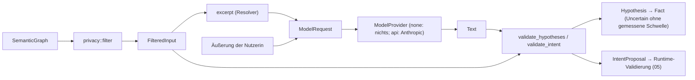
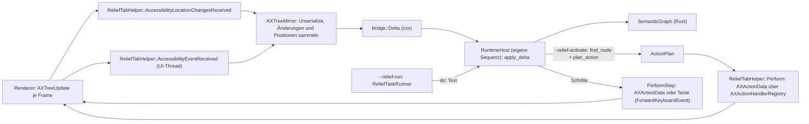
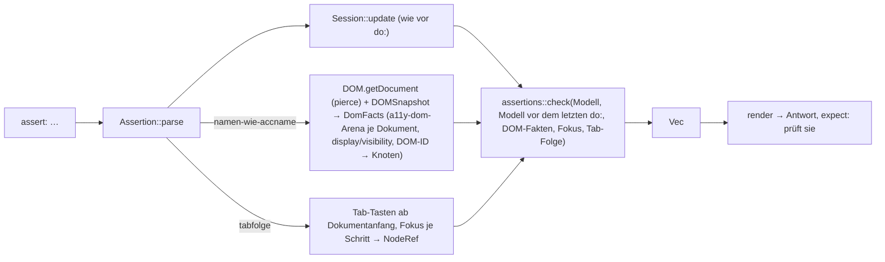

# Architektur

Stand: CDP-Spike (Phase 0a) und Fork-Grundgerüst (Phase 0b): Der
Relief-Build von Chromium 154.0.8037.58 liest den AXTree im Browser-Prozess,
gibt Deltas an die Rust-Runtime und führt `activate` über `AXActionData` aus
(Abschnitt „Fork“). Zielbild in `plan/spezifikation/`.

## Crates

```
Cargo.toml                    # Workspace, MIT, publish = false
crates/
├── relief-model/             # browserfrei, serde; a11y-perception nur mit Feature `perception` (Standard)
│   └── src/
│       ├── graph.rs          # SemanticGraph: ein Baum je Frame/Dokument, Child-Trees, Dokumentreihenfolge
│       ├── node.rs, role.rs  # SemanticNode mit typisierten Zuständen, Relationen, Rolle
│       ├── fact.rs, id.rs    # Fact/Certainty/Source; TreeId, NodeId, NodeRef, GraphVersion
│       ├── delta.rs          # TreeDelta: ableiten (between) und anwenden (apply)
│       └── perception.rs     # Konverter a11y_perception::AXTree → SemanticGraph (Feature `perception`)
├── relief-bridge/            # browserfrei, relief-model + relief-interaction + cxx
│   ├── src/
│   │   ├── runtime.rs        # Runtime: Delta anwenden, Auskunft zu Knoten, Suche nach Name, Aktionswunsch → ActionPlan
│   │   ├── command.rs        # Befehle im Fork: Eingabe → Session → Schritte (AXActionData oder Taste), Antwort nach der Ruhe
│   │   ├── inspector.rs      # Inspector: Graph als JSON (Herkunft, Zustände, Aktionen, Beziehungen), „im Dokument zeigen“
│   │   └── cxx_bridge.rs     # Variante A: #[cxx::bridge] mit flachen Strukturen, Umwandlung ↔ Modell
│   ├── mojom/                # Variante B: Entwurf relief_runtime.mojom (nicht gebaut)
│   └── benches/bridge.rs     # criterion: Grenze, JSON, Anwenden, Neuaufbau auf spike/recordings
├── relief-interaction/       # browserfrei, relief-model (ohne `perception`) + serde; a11y-dom, accname, a11y-report (barrierlab)
│   ├── src/
│   │   ├── graph.rs          # SemanticGraph → Graph (Bereiche, Überschriften, Bedienelemente, Fließtext; Ziele als NodeRef + DOM-ID); Fokus der Seite
│   │   ├── page.rs           # Seitentyp, funktionale Gruppen (Produkt, Formular), primäre Aktion — erschlossen mit Evidence, nie Known
│   │   ├── command.rs        # Text → Command (feste Formulierungen, kein LLM)
│   │   ├── resolve.rs        # Zielbeschreibung → Bedienelement oder Abschnitt/Bereich; Schritte vom Fokus; was sich schließen lässt
│   │   ├── validate.rs       # Bedienelement + Aktion → ActionPlan mit Risikoklasse; Seitentyp Anmeldung/Kasse erhöht (plan_on_page)
│   │   ├── respond.rs        # Antworttexte (auch wo bin ich, Vorlesen, Scrollergebnis), Wirkung einer Aktion aus zwei Modellständen
│   │   ├── session.rs        # Befehlsablauf beider Hosts: Eingabe → Antwort oder Plan (Outcome), Antwort nach der Aktion, Position, Rückfrage mit Token; Aufgabendateien
│   │   ├── security.rs       # Bestätigungstoken (an Plan gebunden, einmalig, kurzlebig), Security-Log ohne Werte, Namen der Grenzen
│   │   └── assertions.rs     # Formular-Zusicherungen (Feature `assertions`, nicht im Fork): Modell + DOM-Fakten (a11y-dom) + Tab-Folge → Befunde (a11y-report); accname für den Namensvergleich
│   └── tests/                # browserfrei gegen spike/recordings (über den Konverter als Modell)
│       ├── recordings.rs     # Graph-Zusammenfassung je Aufnahme ↔ erwartungen/, Graph-Stabilität
│       ├── aufgaben.rs       # Aufgaben aus spike/tasks nachgespielt, Spike-Befunde
│       └── erwartungen/      # erwartete Zusammenfassungen (JSON) je Seite
├── relief-ai-contract/       # browserfrei, relief-model + relief-interaction (Risk) + serde/serde_json
│   ├── schema/               # JSON-Schemas der Modellausgaben (handgeschrieben, Test gegen die Typen)
│   └── src/
│       ├── privacy.rs        # Privacy-Filter: SemanticGraph → FilteredInput (einziger Weg zur Modelleingabe); Ausschnitt um einen Knoten
│       ├── provider.rs       # ModelProvider, Tier none/os/local/api, NoModel; resolve_missing, propose_intent
│       ├── budget.rs         # Budget/Limits: Grenzen je Aufgabe (Baumgröße, Aufrufe, Wiederholungen, Zeit, Tokens), Abbruch ohne weitere Aufrufe
│       ├── hypothesis.rs     # Hypothese zu fehlendem Namen/Beschreibung, strenge Prüfung; gemessene Schwellen je Modell (leer)
│       ├── intent.rs         # Intent-Vorschlag aus einer Nutzeräußerung, strenge Prüfung
│       └── risk.rs           # assess_risk: Hypothesen erhöhen die Risikoklasse nur
│   (tests/missbrauch.rs: Sicherheits-Regressionsmatrix, je Missbrauchsfall ein fester Test)
├── relief-resolver/          # browserfrei, relief-ai-contract + a11y-perception; ureq nur mit Feature `anthropic`
│   ├── src/
│   │   ├── lib.rs            # resolve_node: Ausschnitt (40 Knoten + Vorfahren) → resolve_missing → Name des Knotens
│   │   ├── anthropic.rs      # Adapter Stufe api: Anfrage/Antwort der Messages API; HTTP nur mit Feature `anthropic`
│   │   ├── replay.rs         # Antworten aufzeichnen und wiedergeben (Tests, Auswertung ohne erneute Kosten)
│   │   ├── sample.rs         # Stichprobe spike/kalibrierung laden, Aufnahme → FilteredInput
│   │   ├── calibrate.rs      # Trefferquote je Confidence-Band, Schwellenvorschlag, Tokens je Anfrage/Seite
│   │   └── main.rs           # `relief-resolver kalibrieren`
│   └── tests/calibrate.rs    # nur Fake-Anbieter (Stufe none, Wiedergabe)
└── relief-cdp/               # Host, chromiumoxide 0.8 + tokio
    └── src/
        ├── capture.rs        # getFullAXTree je Frame, iframes eingehängt, Fokus → AXSnapshot
        ├── live.rs           # DOM-Mutationen + Netzwerk → „Seite ruht“; „geändert seit letzter Aufnahme“
        ├── act.rs            # ActionPlan → DOM/JS am Element (Backend-ID); Escape/Pfeiltasten/Tab als Taste; Scrollen
        ├── assertions.rs     # `assert:`-Zeilen: DOM-Fakten aus DOM.getDocument + DOMSnapshot, Tab-Folge beobachten, Fokus → relief_interaction::assertions
        ├── palette.rs        # Befehlsleiste: Binding, Bestätigung, Protokoll, Selbsttest
        ├── record.rs         # Aufgaben abspielen, AXSnapshots vorher/nachher speichern
        ├── palette.js        # in jedes Dokument eingefügte Leiste (modaler <dialog>, Status-Popover)
        └── main.rs           # Session (Aufnahme → Modell → Graph, Tree-ID je Dokument), Modi run / repl / measure / record / palette
spike/
├── fixtures/                 # eigene Testseiten
├── tasks/                    # Aufgabendateien (url:/do:/assert:/expect:)
├── recordings/               # AXSnapshot-Aufnahmen je Seite und Schritt (JSON)
└── kalibrierung/             # von Hand beschriftete Stichprobe unbenannter Controls (Soll-Namen)
```

`relief-interaction` kennt keinen Browser und kein CDP und liest nur das
Modell (`SemanticGraph`) und für Formular-Zusicherungen DOM-Fakten, die ein
Host übergibt; es läuft unverändert im CDP-Host und hinter dem
Fork-Adapter. Den Befehlsablauf (`session`) teilen sich beide Hosts; sie
führen nur aus, was er zurückgibt, und holen danach die Antwort dort. Die
Zusicherungen hängen am Feature `assertions` (Standard an), weil der Fork
`a11y-dom`, `accname` und `a11y-report` nicht baut.
`a11y-perception`, `a11y-dom`, `accname` und `a11y-report` kommen aus
barrierlab (crates.io).

`relief-model` ist das Modell, das der Fork-Adapter füllt: ein Baum je
Tree-ID, Knoten über (Tree-ID, Node-ID), inkrementelle Änderungen als
`TreeDelta`. Der CDP-Host nimmt `a11y_perception::AXSnapshot`s auf und macht
jede mit dem Konverter zum Modell; Tests tun dasselbe mit den Aufnahmen.
Der Rundtest „Delta aus zwei Aufnahmen anwenden ergibt
die zweite“ läuft auf allen Aufnahmepaaren in `spike/recordings`.

`relief-bridge` ist die Rust-Seite der Grenze zum Fork: Delta rein,
Auskünfte (mit `Certainty`) und geprüfte `ActionPlan`s raus; Befehle in
Sprache kommen als Text rein und als Schritte (`AXActionData` oder Taste)
bzw. Antworttext raus. Der Fork ruft
sie über die `cxx`-Bridge im Browser-Prozess auf (Variante A); die C++-Hälfte
erzeugt Chromiums Build. Der Mojo-Entwurf spiegelt dieselben Strukturen für
einen späteren Utility-Prozess (nicht gebaut).

`relief-ai-contract` ist die Grenze zu Modellen. Ein `ModelProvider` nimmt nur eine
`ModelRequest` an, die nur aus einer `FilteredInput` entsteht, und die nur
aus `filter` (privat, ohne `Deserialize`). Der Filter kopiert nach
Positivliste: keine Werte, kein Feldinhalt, sensible Felder nur mit Rolle,
URLs ohne Query, Tree-IDs durch lokale IDs (`t0:18`) ersetzt. Anbieter liefern
nur Text; `resolve_missing`/`propose_intent` prüfen ihn gegen Schema und
Eingabe und machen daraus `Hypothesis` oder `IntentProposal` — keine
Aktion. Eine Hypothese ist `Uncertain`, außer für ihr Modell ist in
`CALIBRATED_THRESHOLDS` eine gemessene Schwelle eingetragen (heute keine).
`Budget` stellt dieselben Aufrufe unter feste Grenzen je Aufgabe; die erste
Überschreitung beendet die Aufgabe mit verständlichem Grund
(`ModelError::Limit`), danach ruft es keinen Anbieter mehr auf.

`relief-resolver` benennt einzelne Controls ohne Namen: Es schneidet aus der
gefilterten Eingabe einen Ausschnitt um den Knoten (`FilteredInput::excerpt`,
nimmt nur weg) und fragt über `resolve_missing`. Der einzige Adapter spricht
die Anthropic Messages API (Stufe `api`, Key aus `ANTHROPIC_API_KEY`); sein
HTTP-Teil existiert nur mit dem Feature `anthropic`. Die Runtime ruft den
Resolver noch nicht auf; genutzt wird er vom Kalibrierwerkzeug.



## Fork

```
fork/
├── UPSTREAM                  # 154.0.8037.58
├── patches/                  # series + 3 Patches: tabs/BUILD.gn (deps), tab_features.cc (eine Zeile + Include), Side-Panel-/Aktions-ID des Inspectors
└── relief/                   # → src/relief/ (scripts/fork-apply.sh)
    ├── BUILD.gn              # rust_static_library relief_model_rs, relief_bridge_rs (cxx_bindings); source_set relief; group relief_tests
    ├── relief_attach.h       # AttachToTab: einziger Header, den Chromium einbindet
    ├── relief_tab_helper.*   # WebContentsObserver je Tab: AXMode, Pakete/Positionen → Delta, Lebenszyklus der Bäume, Reset, ActionPlan → AXActionData
    ├── relief_switches.h     # --enable-relief, --relief-log, --relief-activate, --relief-run, --relief-screen-reader-mode
    ├── relief_task_runner.*  # --relief-run: Aufgabendateien abarbeiten (url/do/expect), Ruhe = keine AX-Pakete
    ├── inspector/            # Semantic Inspector: Side-Panel-Eintrag kRelief, WebUI chrome://relief-inspector.top-chrome, Ressourcen (embed_resources.py)
    ├── bridge/
    │   ├── ax_tree_mirror.*  # eigener ui::AXTree je Tree-ID, AXTreeObserver, AXNodeData → cxx-Strukturen, Seitenkoordinaten
    │   └── runtime_host.*    # Rust-Runtime auf eigener Sequenz, Messprotokoll, activate planen
    └── testing/              # relief_browsertests (InProcessBrowserTest je Integrationspunkt), data/ Testseiten
```

`scripts/fork-apply.sh` kopiert zusätzlich die Quellen von
`relief-model`, `relief-interaction` und `relief-bridge` nach
`src/relief/crates/`.



- **Aktivierung**: nur mit `--enable-relief`; sonst ist die Subscription aus
  `AttachToTab` leer und Chromium unverändert.
- **Wirkung einer Aktion** steht in der nächsten Delta (PerformAction hat
  keine Antwort); das Protokoll zeigt nach `activate` die benannten Knoten
  der folgenden Deltas.
- **Befehle**: `--relief-run=<aufgaben,…>` (`scripts/fork-run-tasks.sh`)
  arbeitet Aufgabendateien im ersten Tab ab: Eingabe an die Runtime
  (`run_command`), Schritte als `AXActionData` an den Frame des Knotens,
  Escape und Pfeiltasten als echte Tastaturereignisse, Scrollen per
  `kSetScrollOffset`; Ruhe = 300 ms ohne AX-Paket, dann die Antwort
  (`finish_command`). Überschriften und Bereiche werden nicht fokussiert,
  sondern als Startpunkt der Tab-Reihenfolge gesetzt; die Sitzung merkt sich
  dort ihre Position (→ `plan/spezifikation/05`).
- **Inspector**: Strg+Umschalt+I auf der Seite (oder `--relief-inspector`)
  öffnet das Side Panel des Tabs mit der WebUI; sie bekommt nach jeder
  Delta (gebündelt, 250 ms) den Graph als JSON aus der Runtime, wählt mit
  Pfeiltasten aus und zeigt mit der Eingabetaste im Dokument
  (Fokus/Hinbewegen, nie Auslösen). → `plan/spezifikation/01`, „Semantic
  Inspector“.
- **Messen**: `--relief-log=<datei>` schreibt je Paket Zeiten (UI-Thread,
  Warteschlange, Rust) und Knotenzahlen; `scripts/fork-measure.mjs` schreibt
  über CDP Messknoten in die Seite (Ende-zu-Ende-Latenz);
  `--relief-log-nodes=<Rolle,…>` protokolliert Knoten dieser Rollen mit
  Namen und Position (nur lesend). Messläufe mit `--use-mock-keychain`,
  sonst wartet die erste Navigation eines frischen Profils auf den
  Schlüsselbund. Ergebnisse in `plan/spezifikation/09`.
- **Bäume**: die Runtime hält nur Bäume der angezeigten Seite (Wegfall über
  `TreeRemoved` und `PrimaryPageChanged`, Back-Forward-Cache eingeschlossen);
  ein Paket ohne gültigen Anfang wird verworfen, der Baum per
  `ResetAccessibility` neu angefordert, höchstens einmal je 5 s.
- **Positionen**: Seitenkoordinaten des Hauptdokuments in CSS-Pixeln, auch
  für iframe-Bäume (Host-Knoten im Elternbaum als Ursprung), Geräte-Skalierung
  und Browser-Zoom herausgerechnet; bei Verschiebung nur geänderte Knoten als
  `BoundsChange`.
- **Testen**: `autoninja -C out/Relief relief_browsertests &&
  out/Relief/relief_browsertests` (Beobachter, Baum, Aktion, Positionen mit
  Zoom und im iframe, OOPIF, Navigation, Discard, Neuaufbau).
- **Grenzen**: VoiceOver läuft parallel unverändert (→
  `plan/spezifikation/09`, „Nachtrag Paket 19“), der Speicheraufschlag durch
  VoiceOver selbst ist nicht belegt; auf echten Seiten nachgemessen (Wikipedia, spiegel.de,
  Consent-iframes auf spiegel.de und bild.de), cross-site-OOPIFs live
  nicht gesehen, nur im Browser-Test (→ `plan/spezifikation/09`, Nachtrag
  Paket 35). Solange ein Dialog mit `aria-modal` offen ist, enthält der
  Graph nur den Dialog, weil Blink den Rest aus dem Baum nimmt.

## Ablauf eines Befehls (CDP-Host)

```mermaid
flowchart LR
  In["Eingabe"] --> Upd["Session::update: neu aufnehmen nur bei Mutation/Navigation"]
  Upd --> M["perception::from_snapshot"] --> G["graph::Graph::build"]
  In --> Parse["command::parse"] --> Res["resolve / dismissal"]
  G --> Res --> Val["validate::plan_on_page (Graph::page)"]
  Val -->|"HIGH oder unsicherer Name"| Ask["Rückfrage + Token"]
  Ask -->|"nächste Eingabe: ! + derselbe Plan"| Act
  Val --> Act["act.rs: DOM/JS, Escape oder Pfeiltaste"] --> Settle["live.rs: Ruhe abwarten"]
  Settle --> Cap["capture.rs: Aufnahme → Modell"] --> Resp["respond::describe_diff(Modell vorher, nachher)"]
```



- **Bestätigung**: Eine Rückfrage legt in `Session` ein Token ab, gebunden
  an Aktion samt Wert, Zielknoten und DOM-ID, Risiko, Graph-Version,
  Zieladresse, Seitenadresse und Ausschnitt (Bedienelement, Seitentyp). „!“
  löst es nur als nächste Eingabe ein, höchstens 60 s nach der Rückfrage und
  nur, wenn derselbe Plan wieder entsteht (neue Graph-Version bei gleichem
  Ausschnitt genügt); jede andere Eingabe verwirft es. „!“ ohne offene
  Rückfrage ergibt nur eine neue Rückfrage. Entscheidungen landen im
  Security-Log (`Session::take_security_log`: Entscheidung, Plan-ID,
  Aktionsart, Risiko, Grund; keine Werte, keine Namen). Beide Hosts holen
  es noch nicht ab; es hält die letzten 256 Einträge.
- **Modell**: Jede Aufnahme wird mit `relief_model::perception` zum
  `SemanticGraph`. Die Tree-ID des Hauptdokuments (`dokument-N`) wechselt bei
  Navigation und `DOM.documentUpdated`; über Dokumente hinweg wird kein Knoten
  zugeordnet. Ziele von Aktionen sind `NodeRef`s, ausgeführt wird über ihre
  DOM-ID.

- **Änderungssignal**: `live.rs` hört auf DOM-Mutationsereignisse (der
  DOM-Agent meldet sie nur für übertragene Knoten, deshalb `DOM.getDocument`
  mit `depth: -1`). „Seite ruht“ = 150 ms ohne Mutation, keine Anfrage
  ausstehend und, falls seit Beginn des Wartens Netzverkehr war, 500 ms ohne
  Netzwerkereignis (`requestWillBeSent`, `loadingFinished`, `loadingFailed`);
  höchstens 3 s. Nicht ausstehend zählen `EventSource`, Beacons (`Ping`),
  Medien, WebSockets (kein `requestWillBeSent`) und Anfragen, die länger als
  1 s offen sind. Die Abos starten vor dem Laden und bleiben über
  Navigationen, damit die Anfragen des Ladens mitzählen.
  Ersetzt die Seite ihr Dokument (`DOM.documentUpdated`), wird es neu
  angefordert. AX-Deltas (`Accessibility.nodesUpdated`) sendet Chrome nicht.
- **Aufnahme**: vor einem Befehl nur, wenn seit der letzten Aufnahme etwas
  mutiert oder navigiert wurde; nach eigenen Aktionen immer, weil nicht jede
  Wirkung eine Mutation auslöst.
- **iframes**: je Frame `getFullAXTree { frameId }`, Knoten-IDs mit
  Frame-Präfix, Frame-Wurzel unter dem `iframe`-Knoten eingehängt. Chrome
  läuft dafür mit `--disable-site-isolation-trials`.
- **Modalität**: Ist ein modaler Dialog offen (`modal`-Eigenschaft), sind in
  seinem Dokument nur seine Bedienelemente erreichbar
  (`Graph::reachable_controls`) — auch bei `aria-modal`, wo Chrome den Rest
  der Seite im AXTree lässt. Ein Dialog im iframe sperrt das Elterndokument
  nicht (`Graph::frames`, wie `inert` in HTML je Dokument).
- **Schließen** („schließe den Dialog“): Ziel ist ein modaler Dialog, sonst
  der Dialog mit dem Fokus, sonst ein aufgeklapptes Popup, sonst der letzte
  Dialog (`resolve::dismissal`, Fokus live abgefragt). Ohne Schließen-Button
  Escape an das fokussierte Element; liegt es nicht im Ziel, sagt die
  Antwort, wohin Escape ging.
- **Befehlsleiste** (`palette`): `palette.js` kommt per
  `Page.addScriptToEvaluateOnNewDocument` in jedes Dokument und ruft den Host
  über die Binding `reliefCommand`. Sie ist selbst ein modaler `<dialog>`, damit
  sie über modalen Seitendialogen bedienbar bleibt; weil sie dann die Seite
  inert macht, schließt der Host sie vor jedem Befehl (der Browser gibt den
  Fokus zurück), nimmt auf und zeigt die Antwort danach in der Leiste oder —
  nach ausgeführten Aktionen — als Status-Popover, ohne den Fokus zu nehmen.
  Leiste und Popover werden aus jeder Aufnahme entfernt.
- **Erfolg einer Aktion** wird am Diff und am Zustand des Zielelements
  (Wert, Zustände) abgelesen, nicht am Rückgabewert.
- **Fokusbezogene Befehle** („wo bin ich“, nächster Abschnitt/nächstes
  Feld, „lies den Abschnitt“ ohne Namen, „schließe den Dialog“) fragen den Fokus vor der Antwort neu
  ab, weil ein Fokuswechsel keine DOM-Mutation ist, und ordnen ihn über die
  DOM-ID einem Knoten des Modells zu. Im Diff nach einer Aktion kommt der
  Fokus dagegen aus den Baumdaten (im iframe: das Element im Frame). Seine Stelle in der
  Gliederung: Bedienelemente und Fließtext tragen die vorausgehende
  Überschrift; ein Abschnitt reicht bis zur nächsten Überschrift gleicher
  oder höherer Ebene.
- **Navigation** zu Überschrift/Bereich: `ActionKind::NavigateTo` setzt bei
  nicht fokussierbaren Zielen `tabindex="-1"` bis zum Verlassen, fokussiert
  und scrollt dorthin. **Erhöhen/Verringern** sendet echte Pfeiltasten an das
  fokussierte Element (native Felder und Tasten-Widgets). **Scrollen** hat
  kein Zielelement und läuft wie Escape ohne `ActionPlan`; die Antwort kommt
  aus der Scrollposition.

## Formular-Zusicherungen (Linie B)



- **Aufteilung**: `relief-cdp/src/assertions.rs` erhebt, `relief-interaction`
  wertet aus. DOM-Fakten nur für `namen-wie-accname`: Tag, Text und die
  Attribute aus `dom_attribute_needed`, ohne `script`, `style`, `template`,
  `noscript`; je Dokument eine Arena (Hauptdokument und jedes iframe im
  selben Renderer-Prozess, eigene IDs), Shadow DOM des Autors flach unter dem
  Host (Slots aufgelöst, Shadow DOM des Browsers weggelassen). Aus
  `DOMSnapshot.captureSnapshot` kommen `display`/`visibility` je Element
  (ohne Layout-Objekt: `none` bzw. `contents`) und die Leerraum-Textknoten,
  die `DOM.getDocument` auslässt. `DomDocument` erfüllt `a11y_dom::Rendering`
  (ohne Geometrie), `accname::name_rendered` rechnet darauf; eine Abweichung
  zu Chromiums Namen ist ein `review`-Befund mit beiden Werten. iframes in
  einem anderen Prozess fehlen, Felder dort sind `untested`.
- **Statusmeldung als Änderung**: Der Host merkt sich vor jeder
  `do:`-Zeile das Modell (`before_action`). `TreeDelta::between` davon zum
  aktuellen Modell: Ist die Live-Region mit dem Text dort `created`, ihr
  Elternknoten aber nicht, ist das ein Befund (neu eingefügt); liegt kein
  angelegter oder geänderter Knoten in ihr, ebenfalls (nicht geändert). Ist
  auch der Elternknoten neu (Seite hinter einem jetzt geschlossenen modalen
  Dialog, den die CDP-Aufnahme nicht enthält), kein Befund.
- **Fokus** wird wie bei fokusbezogenen Befehlen live abgefragt
  (`Session::focus`), nicht der Aufnahme entnommen.
- **Tab-Folge**: ein per Skript fokussiertes `<span tabindex=-1>` am Anfang
  von `body` ist der Startpunkt (danach entfernt); nach jedem Tab die
  Backend-ID von `document.activeElement`, Ende bei `body`, Wiederholung
  oder 60 Schritten. Tab läuft wie Escape und Scrollen ohne `ActionPlan`.
- **Befunde**: `a11y_report::Finding` mit Regel-ID (`form/…`), `Outcome`
  (`fail` belegt, `review` heuristisch, `untested` ohne Daten),
  Schweregrad, WCAG-Kriterien, Verortung über die DOM-ID, Rolle und Name.
  Tabelle der Zusicherungen in `plan/spezifikation/12`.

## Grenzen des Hosts

- Aktionen laufen über DOM/JavaScript (`click()`, nativer `value`-Setter,
  `select.value`, `focus()`, `scrollTo`) bzw. echte Escape-, Pfeil- und
  (für `tabfolge`) Tab-Tasten, nicht über `AXActionData`.
- `aria-valuetext` kommt über CDP leer an (`valuetext: ""`); der Textwert
  eines ARIA-Schiebereglers ist nur über den Diff (neuer Text) sichtbar.
- Vollsnapshot bei jeder Änderung; keine inkrementellen AX-Updates.
- Einzelne iframes bleiben unerreichbar (werden gezählt).
- Websites erkennen den Host als Automatisierung (zeit.de headless, amazon.de).
- Der Status-Popover liegt bei offenem modalem Seitendialog im inerten Bereich:
  sichtbar, aber nicht von Screenreadern angesagt (für die Studienzielgruppe
  ohne Zeigerbedienung ausreichend).
